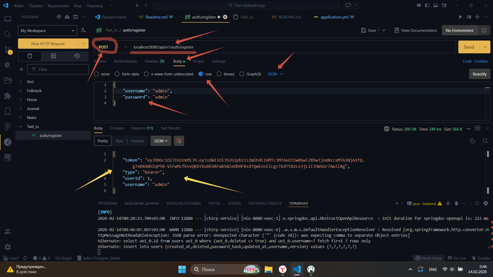
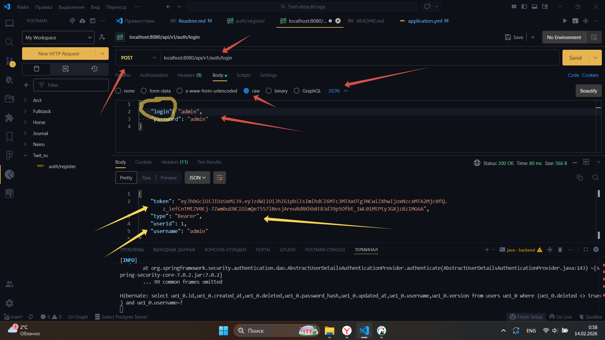
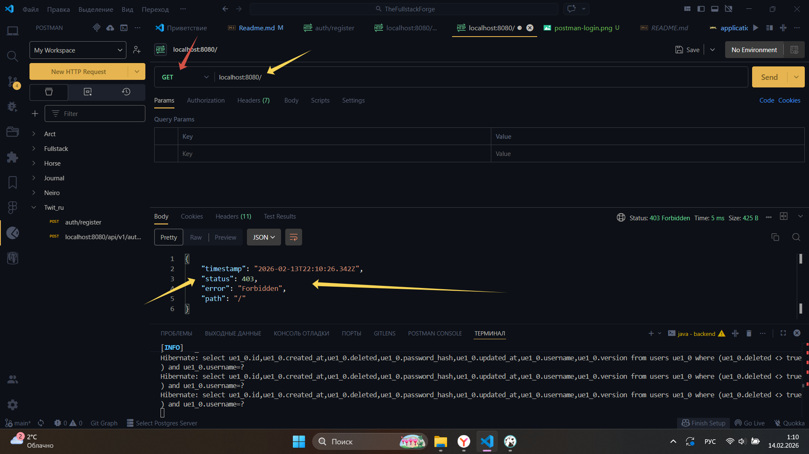
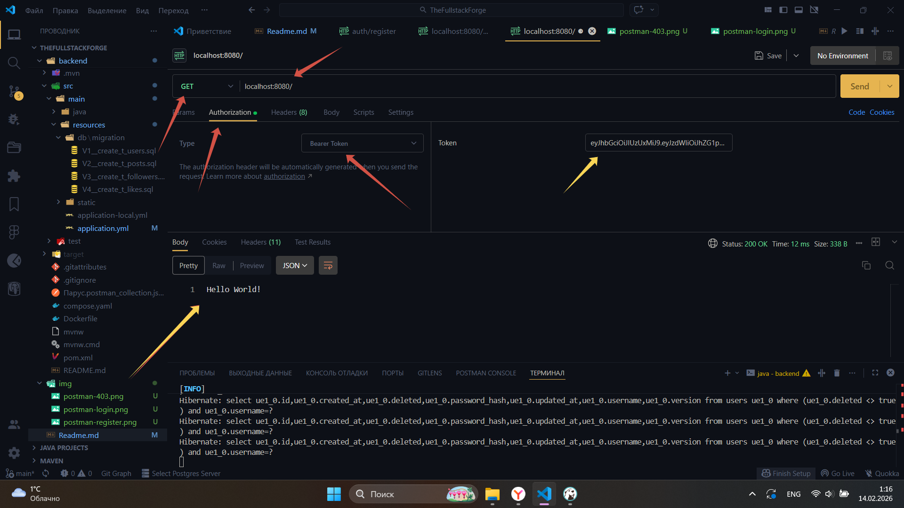
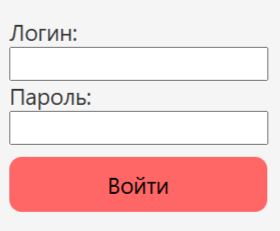
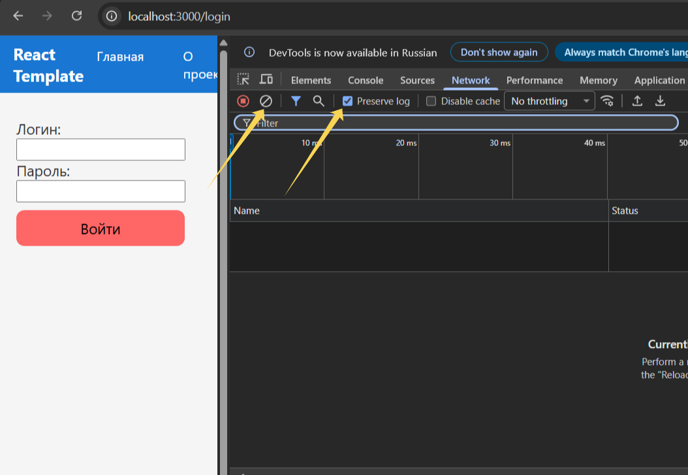
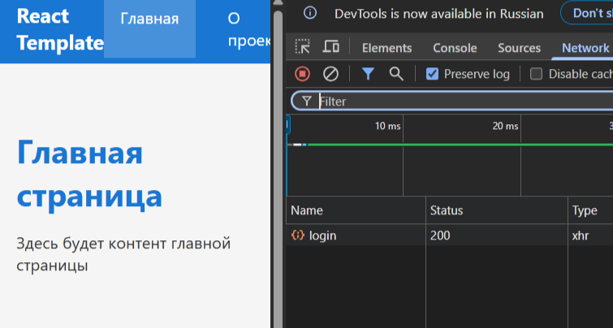
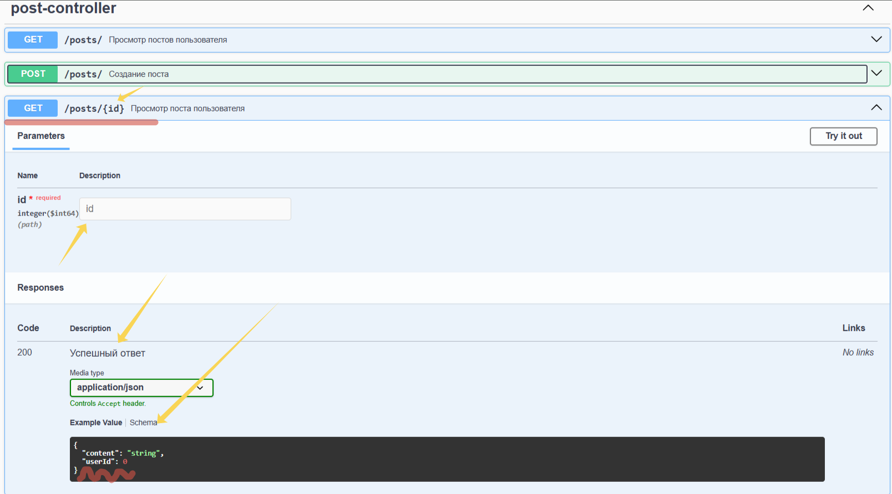
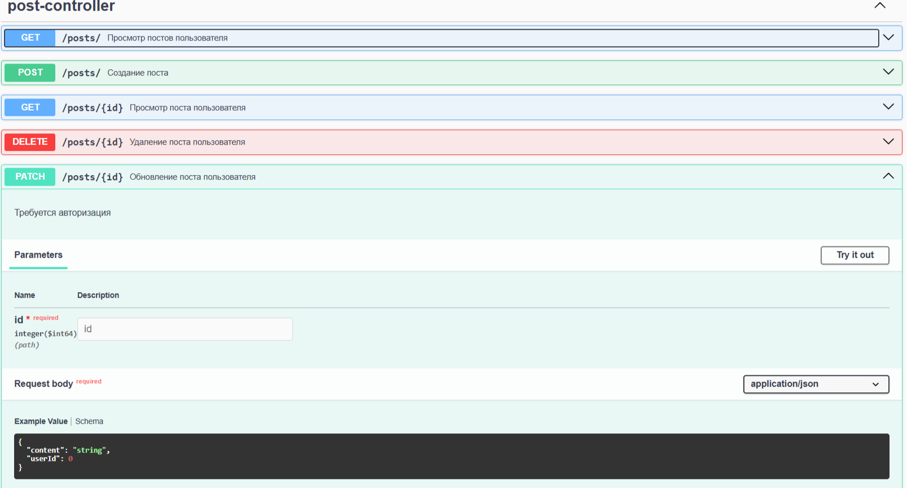

# The Fullstack Forge
Фулстек-Кузница

!!ВНИМАНИЕ!! Критические изменения, обновите backend-файлы и frontend-файлы

> 04.04.2026 (описание работы с db + развёртывание backend + frontend)

- [Первый запуск db](#Первый-запуск-db)
- [Обзор второй части работы с db - ТРИГЕРЫ](#Обзор-второй-части-работы-с-db---ТРИГЕРЫ)
- [Разворот backend-приложения под db](#Разворот-backend-приложения-под-db)
- [Настройка frontend-приложения под просмотр post и создание](#Настройка-frontend-приложения-под-просмотр-post-и-создание)
- [Настройка просмотра всех постов](#Настройка-просмотра-всех-постов)
- [Просмотр и изменение определённого поста](#Просмотр-и-изменение-определённого-поста)
- [Разбор backend и frontend на уровне приложений c 0 (подробный разбор)](#Разбор-backend-и-frontend-на-уровне-приложений-c-0-(подробный-разбор))
- [Вопросы по db](#Вопросы-по-db)
- [Вопросы по fullstack](#Вопросы-по-fullstack)

---
# Запуск приложений
> frontend
```
cd frontend
npm i
npm run dev
```

> backend
Запуск с очисткой
```
cd backend
mvn clean spring-boot:run
```

Простой запуск
```
mvn spring-boot:run
```
---

## Database

### Первый запуск db
Скачиваем и устанавливаем Postgresql

Ссылка для скачивания (Windows): <a href="https://postgrespro.ru/windows" target="_blank">PostgreSQL</a>

Обратите внимение на версию PosgresSQL, если не уследили, то информация в [Вопросы по db](#Вопросы-по-db) (см. Вопрос 2)

Далее настраиваем переменную окружения, чтобы работало через `cmd`. Для этого находим ярлык "Мой компьютер" или внитри директории "Мой компютер" нажимаем правой кнопкой -> Свойства -> Дополнительные параметры системы -> Переменные среды -> ищем PATH и нажимаем 2 раза по нему, откроется окно -> Создать -> и вставляем "C:\Program Files\PostgreSQL\18\bin" !НО! 18 меняем на свою версию!

После перезапускаем cmd и вводим команду
```
"C:\Program Files\PostgreSQL\18\bin\psql.exe" -U postgres
```

Если получили ответ:
```
psql (18.0)
ПРЕДУПРЕЖДЕНИЕ: Кодовая страница консоли (866) отличается от основной
                страницы Windows (1251).
                8-битовые (русские) символы могут отображаться некорректно.
                Подробнее об этом смотрите документацию psql, раздел
                "Notes for Windows users".
Введите "help", чтобы получить справку.
```

То всё работает, выход -> `Ctrl + C` или `\q`

СУБД готова к работе, для взаимодействия с ней можно использовать приложения: `pgAdmin 4` или `DBeaver`

Ссылки для скачивания:
* <a href="https://www.pgadmin.org/download/" target="_blank">pgAdmin 4</a>
* <a href="https://dbeaver.io" target="_blank">DBeaver</a>

Я буду использовать `DBeaver`

#### Создание первой database
1. Запускаем `DBeaver` и нажимаем `Новое подключение` -> PostgresSql

2. Заполните параметры подключения:
```text
Главная вкладка:
- Хост (Host): localhost
- Порт (Port): 5432 (стандартный порт PostgreSQL)
- База данных (Database): postgres (или имя вашей базы)
- Имя пользователя (Username): postgres
- Пароль (Password): [пароль, который вы задали при установке]
```

Аналогия для понимания структуры PostgreSQL:

* PostgreSQL — это многоквартирный дом.

* База данных (Database) — квартира, где хранятся ваши вещи (таблицы, данные).

* Пользователь (User) — жилец с ключом от подъезда (доступ к серверу).

* Владелец базы (Owner) — собственник квартиры (может создавать таблицы, управлять правами).

* Гости (Read-only доступ) — могут зайти в квартиру, но ничего не меняют.

3. Создаем пользователей: (Правой кнопкой по postgress -> Редактор SQL -> Открыть SQL скрипт)
```sql
-- 1. Администратор (самый главный)
CREATE USER fs_admin WITH PASSWORD 'admin123';

-- 2. Разработчик (обычный пользователь)
CREATE USER fs_developer WITH PASSWORD 'dev123';

-- 3. Читатель (только смотрит)
CREATE USER fs_viewer WITH PASSWORD 'viewer123';
```

4. Создание базы данных с назначение владельца
```sql
-- Создаем базу для нашего проекта
CREATE DATABASE the_fullstack_force OWNER fs_admin;
```

Проверяем:
```sql
SELECT datname FROM pg_database WHERE datname = 'the_fullstack_force';
```

5. Подключаемся к НОВОЙ базе как администратор
* ВАЖНО! Теперь нужно подключиться к the_fullstack_force, а не к postgres!
    - Создайте новое подключение:
```text
Host: localhost
Port: 5432
Database: the_fullstack_force  ← ИМЯ НАШЕЙ БАЗЫ!
Username: fs_admin
Password: admin123
```

6. Открываем новый SQL скрипт в новом подключении и создаём таблицу:
```sql
create table if not exists products (
	id bigint generated always as identity primary key, -- уникальный номер
	name varchar(100) not null, --название, не может быть пустым
	category varchar(50), -- категория (мобильные, ноутбуки)
	price DECIMAL(10, 2) not null, -- цена (10 цифр всего, 2 после запятой)
	quantity int default 0, -- количество на складе, по умолчанию 0
	created_at timestamp default current_timestamp -- дата обновления
)
```

После создания в панели проекта нажать `F5` для обновления, после этого появится таблица под названием `products`

При создании таблицы обратите внимание на каждую строку, а более подробно на `if not exists` такую строчку нужно добалять везде, так как она говорит о том, что созданий таблицу, если её не существует. Если не прописывать, то можно перезатереть данные таблицы и положить проект

7. Выполняем задание номер 1: `Добавить в таблицу продуктов 3-4 записи`
    - Добавляем одну запись в таблицу
```sql
insert into products (name, category, price, quantity)
values ('iPhone 15', 'Смартфон', 999.99, 10)
```
    - Добавляем стек товаров (несколько товаров за раз)
```sql
insert into products (name, category, price, quantity) values
('MacBook Air M2', 'Ноутбуки', 1299.99, 5),
('Samsung Galaxy S24', 'Смартфоны', 849.99, 15),
('Наушники Sony', 'Аксессуары', 199.99, 30);
```

Проверка результата:
```sql
select * from products;
```

Данные должны полностью отобразиться, обратите внимение на время создания, когда добавляли несколько данных за раз, время создания одинаковое у всех 3-х товаров

Запрос на проверку опасный, так как если записей в таблице миллионы, то положим базу данных, лучше использовать:
```sql
select * from products limit 2;
```

или если нужно посмотреть последние записи, то:
```sql
SELECT * FROM products 
ORDER BY created_at DESC 
LIMIT 2;
```

Но эти команды всё равно не безопасные, лучше использовать `explain` или `explain analize`

8. Пример использования команды `explain`
```sql
explain select * from products
```
EXPLAIN - только планирование

Вывод (пример):
```text
                       QUERY PLAN
---------------------------------------------------------
 Seq Scan on products  (cost=0.00..15.00 rows=1000 width=36)
```

Что показывает:

* cost=0.00..15.00 — оценка стоимости (условные единицы)

* 0.00 — стоимость запуска

* 15.00 — общая стоимость

* rows=1000 — ожидаемое количество строк

* width=36 — средний размер строки в байтах
---

9. Пример использования команды `explain analyze`
```sql
explain analyze select * from products
```

Вывод (пример):
```text
                       QUERY PLAN
---------------------------------------------------------
 Seq Scan on products  (cost=0.00..15.00 rows=1000 width=36)
                       (actual time=0.008..0.250 rows=1000 loops=1)
 Planning Time: 0.050 ms
 Execution Time: 0.300 ms
```

Что показывает дополнительно:

* actual time=0.008..0.250 — реальное время в миллисекундах

* 0.008 — время до первой строки

* 0.250 — время получения всех строк

* rows=1000 — реальное количество строк

* loops=1 — сколько раз выполнялся этот шаг

* Planning Time — время на построение плана

* Execution Time — общее время выполнения

10. Когда что использовать
* Используйте EXPLAIN когда:
    - Хотите быстро посмотреть план запроса

    - Работаете с данными в продакшене (безопасно)

    - Анализируете сложный запрос без его выполнения

    - Учитесь читать планы выполнения

* Используйте EXPLAIN ANALYZE когда:
    - Оптимизируете медленный запрос

    - Тестируете на тестовых данных

    - Хотите сравнить разные варианты запроса

    - Нужны реальные метрики (время, строки)

11. Подключаем других пользователей к базе и настраиваем права
```sql
-- 1. Даем права на подключение к базе для всех пользователей
GRANT CONNECT ON DATABASE the_fullstack_force TO fs_developer, fs_viewer;
```

```sql
-- 2. Даем права на использование схемы public (или созданной вами схемы)
GRANT USAGE ON SCHEMA public TO fs_developer, fs_viewer;
```

```sql
-- Разработчик: может читать, добавлять, изменять, удалять данные
GRANT SELECT, INSERT, UPDATE, DELETE ON products TO fs_developer;
```

```sql
-- Читатель: может только читать данные
GRANT SELECT ON products TO fs_viewer;
```

12. Создаем схему для лучшей организации (опционально, но рекомендуется)
```sql
-- Создаем отдельную схему для нашего приложения
CREATE SCHEMA IF NOT EXISTS app_schema;

-- Переносим таблицу в схему
ALTER TABLE products SET SCHEMA app_schema;

-- Даем права на схему
GRANT USAGE ON SCHEMA app_schema TO fs_developer, fs_viewer;

-- Обновляем права на таблицу в новой схеме
GRANT SELECT, INSERT, UPDATE, DELETE ON ALL TABLES IN SCHEMA app_schema TO fs_developer;
GRANT SELECT ON ALL TABLES IN SCHEMA app_schema TO fs_viewer;
```

13. Права на будущие таблицы в схеме app_schema
```sql
-- Автоматически давать права на новые таблицы в схеме
ALTER DEFAULT PRIVILEGES IN SCHEMA app_schema
GRANT SELECT, INSERT, UPDATE, DELETE ON TABLES TO fs_developer;

ALTER DEFAULT PRIVILEGES IN SCHEMA app_schema
GRANT SELECT ON TABLES TO fs_viewer;

-- Для последовательностей
ALTER DEFAULT PRIVILEGES IN SCHEMA app_schema
GRANT USAGE, SELECT ON SEQUENCES TO fs_developer;
```

14. Тестируем права разных пользователей

fs_developer (должен читать и изменять)

* Создайте новое подключение в DBeaver:
```text
Database: the_fullstack_force
Username: fs_developer
Password: dev123
```

* Выполните запросы по очередно и проанализируйте:
```sql
SELECT * FROM app_schema.products; -- Чтение ✓

INSERT INTO app_schema.products (name, category, price, quantity)
VALUES ('Новый товар', 'Тест', 100.00, 5); -- Вставка ✓

UPDATE app_schema.products 
SET price = price * 1.1 
WHERE category = 'Смартфоны'; -- Обновление ✓

SELECT * FROM app_schema.products; -- Чтение ✓

DELETE FROM app_schema.products 
WHERE id = 5; -- Удаление ✓

SELECT * FROM app_schema.products; -- Чтение ✓

CREATE TABLE app_schema.test (id SERIAL); -- Создание таблицы ✗

DROP TABLE app_schema.products; -- Удаление таблицы ✗
```
---

fs_viewer (только чтение)

* Создайте новое подключение в DBeaver:
```text
Database: the_fullstack_force
Username: fs_viewer
Password: viewer123
```

* Выполните запросы по очередно и проанализируйте:
```sql
-- ДОЛЖНО РАБОТАТЬ:
SELECT * FROM app_schema.products;  -- Чтение ✓
SELECT COUNT(*) FROM app_schema.products;  -- Агрегация ✓

-- НЕ ДОЛЖНО РАБОТАТЬ (ошибка):
INSERT INTO app_schema.products (name, category, price, quantity)
VALUES ('Запрещено', 'Тест', 50.00, 1);  -- Вставка ✗

UPDATE app_schema.products SET price = 0;  -- Обновление ✗
DELETE FROM app_schema.products; 
```

15. Создаем дополнительные таблицы с правами
Вернитесь в подключение как fs_admin и создайте еще таблицу:
```sql
-- Таблица заказов
CREATE TABLE IF NOT EXISTS app_schema.orders (
    id BIGINT GENERATED ALWAYS AS IDENTITY PRIMARY KEY,
    product_id BIGINT REFERENCES app_schema.products(id),
    user_id BIGINT,
    quantity INTEGER NOT NULL,
    total_price DECIMAL(10, 2) NOT NULL,
    status VARCHAR(20) DEFAULT 'pending',
    created_at TIMESTAMP DEFAULT CURRENT_TIMESTAMP
);
```

Права автоматически применятся благодаря ALTER DEFAULT PRIVILEGES

Если не хочется таким образом создавать схемы `app_schema.orders` используйте команду для переключения на нужную схему:
```sql
SET schema 'app_schema';
```

16. Резюме созданной структуры
```text
┌─────────────────────────────────────────────────────────┐
│               База: the_fullstack_force                 │
│                    Владелец: fs_admin                   │
├─────────────────────────────────────────────────────────┤
│                                                         │
│  fs_admin       →  ВСЁ: SELECT, INSERT, UPDATE,         │
│                     DELETE, CREATE, DROP, ALTER         │
│                                                         │
│  fs_developer   →  Данные: SELECT, INSERT, UPDATE,      │
│                     DELETE (но не структуру)            │
│                                                         │
│  fs_viewer      →  Только: SELECT                       │
│                                                         │
│  fs_backup      →  Только: SELECT (для бэкапов)         │
│                                                         │
└─────────────────────────────────────────────────────────┘
```

17. Удалите ненужную таблицу:
```sql
DROP TABLE orders;
```

F5

#### Выполнение задачи №3  создать новую таблицу категорий продуктов (связь с products Many-to-Many)
Связать таблицу продуктов с таблицей категорий в отношении многие ко многим

Запросы осуществлять от имени админа в схеме app_schema -> sql-запрос
1. Создаём таблицу категорий
```sql
-- Таблица категорий продуктов
CREATE TABLE IF NOT EXISTS categories (
    id BIGINT GENERATED ALWAYS AS IDENTITY PRIMARY KEY,
    name VARCHAR(50) UNIQUE NOT NULL,           -- уникальное название категории
    slug VARCHAR(50) UNIQUE NOT NULL,           -- URL-дружественное имя (например: smartphones)
    description TEXT,                           -- описание категории
    parent_id BIGINT REFERENCES categories(id), -- иерархия (подкатегории)
    is_active BOOLEAN DEFAULT true,             -- активна ли категория
    sort_order INTEGER DEFAULT 0,               -- порядок сортировки
    created_at TIMESTAMP DEFAULT CURRENT_TIMESTAMP,
    updated_at TIMESTAMP DEFAULT CURRENT_TIMESTAMP
);
```

```sql
-- Комментарий к таблице
COMMENT ON TABLE categories IS 'Таблица категорий товаров';
COMMENT ON COLUMN categories.slug IS 'URL-дружественное название (латиница, без пробелов)';
COMMENT ON COLUMN categories.parent_id IS 'ID родительской категории (NULL для корневых)';
```

2. Создаём таблицу связки
Создаем таблицу-связку для отношения многие-ко-многим
```sql
CREATE TABLE IF NOT EXISTS product_categories (
    product_id BIGINT NOT NULL,
    category_id BIGINT NOT NULL,
    is_primary BOOLEAN DEFAULT false,
    created_at TIMESTAMP DEFAULT CURRENT_TIMESTAMP,
    PRIMARY KEY (product_id, category_id)
);
```

```sql
COMMENT ON TABLE product_categories IS 'Связь продуктов и категорий (many-to-many)';
COMMENT ON COLUMN product_categories.is_primary IS 'Является ли основной категорией для продукта';
```

3. Обновляем зависимости и данные
```sql
-- Сначала создаем резервную копию данных
CREATE TABLE IF NOT EXISTS products_backup AS 
SELECT * FROM products;

-- Удаляем старое поле category (если оно есть)
ALTER TABLE products 
DROP COLUMN IF EXISTS category;

-- Добавляем поле для основной категории (опционально, если нужно быстро получать)
ALTER TABLE products 
ADD COLUMN IF NOT EXISTS primary_category_id BIGINT REFERENCES categories(id);

-- Комментарий
COMMENT ON COLUMN products.primary_category_id IS 'ID основной категории (дублирование для оптимизации)';
```

4. Заполняем данным таблицы
* Категории:

```sql
INSERT INTO categories (name, slug, description) VALUES
('Смартфоны', 'smartphones', 'Мобильные телефоны и смартфоны'),
('Ноутбуки', 'laptops', 'Переносные компьютеры'),
('Аксессуары', 'accessories', 'Аксессуары для техники'),
('Наушники', 'headphones', 'Наушники и гарнитуры'),
('Планшеты', 'tablets', 'Планшетные компьютеры'),
('Игровые', 'gaming', 'Игровые устройства и аксессуары'),
('Аудиотехника', 'audio', 'Аудио оборудование'),
('Фотокамеры', 'cameras', 'Фото и видео камеры');
```

* Подкатегории:
```sql
-- Создаем подкатегории
INSERT INTO app_schema.categories (name, slug, description, parent_id) VALUES
('Apple iPhone', 'apple-iphone', 'Смартфоны Apple', 1),
('Android', 'android', 'Смартфоны на Android', 1),
('Игровые ноутбуки', 'gaming-laptops', 'Ноутбуки для игр', 2),
('Беспроводные наушники', 'wireless-headphones', 'Наушники Bluetooth', 4),
('Проводные наушники', 'wired-headphones', 'Наушники с проводом', 4);
```

* Связываем существующие продукты с категориями
1. Проверим, что у нас есть
```sql
-- 1. Какие продукты есть?
SELECT id, name, price FROM products;
```

```sql
-- 2. Какие категории есть?
SELECT id, name, slug, parent_id FROM categories ORDER BY id;
```

2. Связываем продукты с категориями
```sql
-- 1. iPhone 15 → Apple iPhone (основная) + Смартфоны (дополнительная)
INSERT INTO product_categories (product_id, category_id, is_primary) VALUES
(1, 9, true),   -- Apple iPhone (основная)
(1, 1, false);  -- Смартфоны (дополнительная)

-- 2. MacBook Air M2 → Ноутбуки (основная)
INSERT INTO product_categories (product_id, category_id, is_primary) VALUES
(2, 2, true);   -- Ноутбуки (основная)

-- 3. Samsung Galaxy S24 → Android (основная) + Смартфоны (дополнительная)
INSERT INTO product_categories (product_id, category_id, is_primary) VALUES
(3, 10, true),  -- Android (основная)
(3, 1, false);  -- Смартфоны (дополнительная)

-- 4. Наушники Sony → Наушники (основная) + Аксессуары + Аудиотехника
INSERT INTO product_categories (product_id, category_id, is_primary) VALUES
(4, 4, true),   -- Наушники (основная)
(4, 3, false),  -- Аксессуары (дополнительная)
(4, 7, false);  -- Аудиотехника (дополнительная)
```

3. Обновляем primary_category_id в таблице products
```sql
-- Обновляем основную категорию для каждого продукта
UPDATE products p
SET primary_category_id = pc.category_id
FROM product_categories pc
WHERE p.id = pc.product_id 
  AND pc.is_primary = true;

-- Проверяем
SELECT id, name, primary_category_id FROM products;
```

4. Полезные запросы для работы со связями
```sql
-- 1. Найти продукты без категорий
SELECT p.*
FROM products p
LEFT JOIN product_categories pc ON p.id = pc.product_id
WHERE pc.product_id IS NULL;

-- 2. Найти категории без продуктов
SELECT c.*
FROM categories c
LEFT JOIN product_categories pc ON c.id = pc.category_id
WHERE pc.category_id IS NULL;

-- 3. Товары, которые относятся к нескольким категориям
SELECT 
    p.name,
    COUNT(pc.category_id) as categories_count
FROM products p
JOIN product_categories pc ON p.id = pc.product_id
GROUP BY p.id, p.name
HAVING COUNT(pc.category_id) > 1
ORDER BY categories_count DESC;

-- 4. Самая популярная категория (по количеству товаров)
SELECT 
    c.name,
    COUNT(pc.product_id) as products_count
FROM categories c
JOIN product_categories pc ON c.id = pc.category_id
GROUP BY c.id, c.name
ORDER BY products_count DESC
LIMIT 1;
```

Связь осуществлена

5. Что может пригодиться?
* Добавление колонки в существующую таблицу
```sql
ALTER TABLE app_schema.products 
ADD COLUMN brand VARCHAR(50);
```

* Добавить колонку с ограничениями
```sql
ALTER TABLE app_schema.products 
ADD COLUMN rating DECIMAL(2,1) CHECK (rating >= 0 AND rating <= 5);
```

* Изменение типа данных колонки
```sql
ALTER TABLE app_schema.products 
ALTER COLUMN price TYPE DECIMAL(12,2);

-- Изменить VARCHAR(50) на VARCHAR(100)
ALTER TABLE app_schema.products 
ALTER COLUMN name TYPE VARCHAR(200);
```

* Удаление колонки в существующей таблице
```sql
ALTER TABLE app_schema.products 
DROP COLUMN IF EXISTS old_price;
```

Удаление опасно, если только проектируете, то лучше удалять каскадом!

### Обзор второй части работы с db - ТРИГЕРЫ
1. Добавление колонки количества продуктов в таблицу `products`
```sql
ALTER TABLE products 
ADD COLUMN stock_quantity INT DEFAULT 0;
```

2. Создаём колонку в таблице `categories`
```sql
ALTER TABLE categories 
ADD COLUMN product_count INT DEFAULT 0;
```

Будем создавать `триггер` - простыми словами: автоматическая функция, которая отрабатывает, если данные меняются

`Триггер` - специальная хранимая процедура, которая автоматически выполняется при определённых событиях в таблице

* События (хуки/реакции на изменения):
    - `INSERT` - рекция при добавлении записи
    - `UPDATE` - реакция на изменение записи
    - `DELETE` - реакция при удалении записи

* Плюсы:
    - Автоматизация
    - Целостность данных
    - Аудит (логирование)
    - Бизнес-правила - принудительное выполнение правил на уровне БД

* Минусы:
    - Скрытая логика - сложнее отлаживать
    - Производительность
    - Каскадные эффекты - могут вызывать другие триггеры

Если не использовать треггеры, то данные можно не изменить, что повлечёт к неправильным данным

3. Пишем функцию для изменения количества товаров, если добавились данные в таблице
```sql
CREATE OR REPLACE FUNCTION update_category_product_count()
RETURNS TRIGGER AS $$
BEGIN
    IF TG_OP = 'INSERT' THEN
        UPDATE categories
        SET product_count = product_count + 1
        WHERE id = NEW.category_id;
    END IF;
    RETURN NULL;
END;
$$ LANGUAGE plpgsql;
```

Разберём строки
- `CREATE OR REPLACE FUNCTION update_category_product_count()` - создаём функцию
- `RETURNS TRIGGER AS $$` - возвращаем подписку на триггер, это функция \действие\, а не подписка
- `BEGIN ... END` - условие, что должна делать функция
- 
```sql
IF TG_OP = 'INSERT' THEN
    UPDATE categories
    SET product_count = product_count + 1
    WHERE id = NEW.category_id;
END IF;
```
- если создание, то измени в таблице `categories` колонку `product_count` на `+1`, когда добавляется новый продукт (точнее новый id в таблице product)

Как посмотреть существующие функции?
```sql
SELECT 
    proname AS function_name,
    prosrc AS function_code
FROM pg_proc 
WHERE pronamespace = 'app_schema'::regnamespace
AND proname LIKE '%category%';
```

4. Создаём подписку на созданную функцию `update_category_product_count()`
```sql
CREATE TRIGGER trg_update_product_count
AFTER INSERT ON products
FOR EACH ROW
    EXECUTE FUNCTION update_category_product_count();
```

* Разберём по строчкам
`CREATE TRIGGER trg_update_product_count` - создай триггер (подписку) с названием: `trg_update_product_count`
`AFTER INSERT ON products` - запусти триггер ПОСЛЕ выполнения операции INSERT, то есть создания строки в таблице `product`
`FOR EACH ROW` - срабатывает для каждой изменённой строчки
`EXECUTE FUNCTION update_category_product_count();` - запусти функцию `update_category_product_count()`

* Как посмотреть триггеры?
```sql
-- 1. Все триггеры в текущей базе
SELECT 
    tgname AS trigger_name,
    tgrelid::regclass AS table_name,
    pg_get_triggerdef(oid) AS definition
FROM pg_trigger
WHERE tgname NOT LIKE 'pg_%'  -- исключаем системные
AND tgname NOT LIKE 'RI_%'    -- исключаем внешние ключи
ORDER BY table_name, trigger_name;
```

5. Проверка работы триггера
* Перед тем как проверять, я опечатался в названии колонки `primary_category_id` в таблице `products`, так называть нельзя, поэтому переименуем в нормальную форму
```sql
ALTER TABLE products 
RENAME COLUMN primary_category_id TO category_id;
```

Посмотрите и запомните таблицу `products` & `categories` особенно колонку `product_count`

* Создаём продукты
```sql
insert into products(name, price, quantity, category_id)
values
	('Mackbook', 200000, 2, 2),
	('Honor планшет', 8550, 5, 5)
```

Проверяем, таблицы изменились и `product_count` тоже поменялся

#### Выполнение практического задания
Добавить триггер для операции DELETE и UPDATE

Не вижу смысла создавать Update, так как триггер работает на создание, поэтому дополним логику на удаление
```sql
CREATE OR REPLACE FUNCTION update_category_product_count()
RETURNS TRIGGER AS $$
BEGIN
    IF TG_OP = 'INSERT' THEN
        UPDATE categories
        SET product_count = product_count + 1
        WHERE id = NEW.category_id;
    END IF;
	IF TG_OP = 'DELETE' THEN
		UPDATE categories
		SET product_count = product_count - 1
		WHERE id = OLD.category_id;
	END IF;
    RETURN NULL;
END;
$$ LANGUAGE plpgsql;
```

Обратите внимание, что логика функции изменилась, а вот триггер не переназначали, поэтому будет система работать по старой версии функции, нужно перебить триггер или добавить новый триггер
```sql
-- 1. Удалить старый триггер
DROP TRIGGER IF EXISTS trg_update_product_count ON app_schema.products;

-- 2. Создать новый триггер
CREATE TRIGGER trg_update_product_count
AFTER INSERT ON app_schema.products
FOR EACH ROW
EXECUTE FUNCTION update_category_product_count();

-- Создать дополнительный триггер
CREATE TRIGGER trg_update_product_count_v2
AFTER DELETE ON products  -- теперь и на DELETE
FOR EACH ROW
    EXECUTE FUNCTION update_category_product_count();
```

Посмотрите и запомните таблицу `products` & `categories` особенно колонку `product_count`

* Создаём продукты
```sql
insert into products(name, price, quantity, category_id)
values
	('Poko', 20000, 10, 1)
```

Проверяем, таблицы изменились и `product_count` тоже поменялся

* Удаляем товар
```sql
DELETE FROM products 
WHERE id = 9;
```

`product_count` изменяется автоматически

Всё это работа архитектора, довольно тяжёлая и код писать сложно, поэтому изменение и практику мы будем осуществлять в приложении бека на языке `JAVA`

# Разворот backend-приложения под db
Скачайте <a href="https://download.oracle.com/java/21/archive/jdk-21.0.9_windows-x64_bin.msi" target="_blank">JDK 21</a>

Добавьте в переменные среды:
```cmd
SET JAVA_HOME=C:\Program Files\Java\jdk-21
SET PATH=%JAVA_HOME%\bin;%PATH%
```

Проверьте установку:
```cmd
java --version
```

Добавление в PATH
```
echo 'export PATH="/opt/homebrew/opt/openjdk@21/bin:$PATH"' >> ~/.zshrc
source ~/.zshrc
```

* Установка Maven
1. Скачайте <a href="https://www.npackd.org/p/org.apache.Maven/3.9.6" targer="_blank">apache-maven-3.9.6</a>

2. Распакуйте в C:\Program Files\apache-maven-3.9.6

3. Нажмите правой кнопкой по "Мой компьютер" -> свойства -> Дополнительные параметры системы -> переменный среды -> двойное нажатие на `Path` -> Создать и в поле вставляем: `C:\Program Files\apache-maven-3.9.6\bin`

4. Перезапустить компьютер и проверьте
```cmd
mvn --version
```

5. Для работы с java проще работать через `IntelliJ IDEA`

6. Скачиваем шаблон `JAVA`

7. Заходим в DBeaver и создаём через `postgres` новую базу, эта задача не зависит, от предыдущей
База `twit_ru` с владельцем `fs_admin`
```sql
CREATE DATABASE twit_ru OWNER fs_admin;
```

8. Заходим в папку с backend и подключаемся к нашей базе, через файл `application.yml`
(возможна опечатка в проекте)
```yml
spring:
  security:
    user: # Можно удалить, если используете свою БД
      name: admin
      password: admin
      roles: USER
  docker:
    compose:
      enabled: false
  application:
    name: chirp-service

  datasource:
    url: ${JDBC_URL:jdbc:postgresql://localhost:5432/twit_ru}
    username: ${JDBC_USER:fs_admin}
    password: ${JDBC_PASSWORD:admin123}
    driver-class-name: org.postgresql.Driver
    dbcp2:
      default-schema: public
  jpa:
    hibernate:
      ddl-auto: ${DDL_AUTO:validate}
    database-platform: org.hibernate.dialect.PostgreSQLDialect
    show-sql: true
  freemarker:
    check-template-location: false
  flyway:
    locations: classpath:/db/migration
    driver-class-name: org.postgresql.Driver
    user: ${JDBC_USER:fs_admin}
    password: ${JDBC_PASSWORD:admin123}
    enabled: true
    default-schema: public

springdoc:
  swagger-ui:
    path: /swagger-ui.html
    enabled: true
  api-docs:
    path: /v3/api-docs
```

9. Запуск приложения
Обратите внимение, команда производится в папке backend
```bash
mvn clean spring-boot:run
```

10. Проверьте через `Dbeaver`, что у вас появились таблицы, они создались автоматически из-за того, что есть папка db, а в ней migration, там описаны какие таблицы должны создаться при запуске проекта.

11. Запуск осуществлён успешно, таблицы созданы
Для проверки запустим сваггер, чтобы посмотреть, какие api у нас существуют. Для этого запустим браузер и ввдем в поисковую строку:
```bash
http://localhost:8080/swagger-ui/index.html
```

12. Ищем в сваггере `auth-controller` с post-запросом `/api/v1/auth/register`
Чтобы заработали `api` - нужен ключ к ним, иначе при запросе будет выдаваться 403 статус - нет прав

Это `api` регистрирует пользователя и выдаёт ему `token`, который позволяет пользоваться другими запросами

Для регистрации первого пользователя и для захода в сервис мы будем использовать приложение `postman`. 

Это приложение скачивается отдельно с официального сайта postman, либо устанавливается расширение (плагин) в VS code

Я буду использовать расширение. Скачиваем расширение с postman, регистрируемся и заходим в приложение.

* Нажимаем `New HTTP Request` и заполняем данные внутри


Красными стрелками обозначен запрос, который мы отправляем на сервер, а жёлтыми стрелками ответ от сервера

Если ответ примерно такой как на скрине, то всё отлично, если ошибка, значит, что-то сделали не так

* После регистрации посмотрите в `DBeaver` в таблицу `users`, у вас появится пользователь в этой таблице

Поздравляю! Приложение бека работает! Теперь можем залогиниться и посмотреть профиль пользователя

13. Логинимся через `Postman`, здесь ничего сложного нет, просто создаём новый запрос `New HTTP Request` и заполняем:


Здесь ничего нового, но обратите внимение, что при логировании не username, а логин. И выдаётся при успешном запросе `Bearer token`, который позволяет использовать другие запросы. Например, если мы сейчас захотим посмотреть информацию по адресу (запрос `localhost:8080/`), то у нас ничего не получится и выдаст 403, не хватает прав. Для этого и применяется `Bearer token` с другого запроса, чтобы дать доступ.

Пример с `Postman` для `get`-запроса `localhost:8080/` с кодом `403`


Чтобы сработал запрос `localhost:8080/`
- Нужно скопировать `Bearer tocken` c ответа запроса `localhost:8080/api/v1/auth/login`
- Зайти в запрос `localhost:8080/` в раздел `Authorization` и найти тип `Bearer`, а справа вставить `token`


Ответ: Hello World - это замечательно!

Все эти запросы мы делили в `postman`, это приложение используется для отладки, тестировки и проверки. Вся реакция для пользователей осуществляется на `frontend`

14. Разворот `frontend`-приложения для работы с `backend`-приложения
Для этого скачайте шаблон `react`-приложения. В моём случае я скачиваю проект `https://github.com/StasOskol/react-vite`

И размещаю его в своём репозитории в папке `frontend`

В терминале перехожу в папку `frontend` и устанавливаю зависимости для запуска
```bash
npm i
```

Используется для зауска `NodeJS` скачивается с официального сайта

Для запуска приложения `frontend` 

!ВАЖНО! ПЕРЕД ЗАПУСКОМ приложения измените файл `.env` на свой адрес сервера бека

Файл `.env`:
```
VITE_API_BASE_URL=http://localhost:8080/
```

Далее:

```bash
npm run dev
```

Создадим на фронте форму для login захода с последующим просмотром постов данного пользователя, созданием, удалением, измением поста

Для этого создадим файл `src/pages/Login/Login.tsx`
```tsx
import './Login.scss';

const Login = () => {
    return <div className='form-auth'>
        <figure className='form-auth-login'>
            <span className='form-auth-login-text'>Логин: </span>
            <input
                className='form-auth-login-inp'
                type="text"
                onChange={(e) => setLogin(e.target.value)}
            />
        </figure>
        <figure className='form-auth-login'>
            <span className='form-auth-login-text'>Пароль:</span>
            <input
                className='form-auth-login-inp'
                type="password"
                onChange={(e) => setPassword(e.target.value)}
            />
        </figure>
        {error && (
            <div className='form-auth-login-error'>
                {error}
            </div>
        )}
        <button
            className='form-auth-login-sing-in'
            onClick={send}
        >
            Войти
        </button>
    </div>
};

export default Login;
```

создадим файл `src/pages/Login/Login.scss`
```scss
@import "@styles/main";

.form-auth {
    width: 400px;
    display: flex;
    flex-direction: column;

    &-login {
        margin-left: 20px;

        &-text {
            display: block;
            font-size: 18px;
        }

        &-inp {
            font-size: 18px;
        }

        &-error {
            color: red;
            margin-left: 20px;
        }

        &-sing-in{
            width: 206px;
            margin-left: 20px;
            margin-top: 10px;
            background: #ff6666;
            font-size: 18px;
            padding: 10px 5px;
            border-radius: 10px;
            transition: background 0.8s;

            &:hover {
                background: #ff0000;
            }
        }
    }
}

```

Форма готова, теперь будем создавать на фронте рекцию на логирование, для этого создадим в папке controller нашу api для login

- Создаём types для Dto данных, которые будут отправляться на сервер
`src/types/auth/login.type.ts`
```ts
export type loginDto = {
    login: string,
    password: string
}
```

- Создай файл `src/services/api/controllers/auth-controller.ts`
```ts
import { api } from "..";
import { loginDto, resLoginDto } from "@/types/auth/login.type";

export const authController = {
    // login
    login: (data: loginDto) => {
        return api.post<resLoginDto>('/api/v1/auth/login', data);
    }
}
```

- Настраиваем роут для login
Заходим в папку `router` -> `AppRouter.tsx` и добавляем
```tsx
...
import Login from './pages/Login/Login';
...
<Route path='/login' element={<Login />} />
...
```

- Дописываем логику отправки данных для входа в сервис
```tsx
import { useState } from 'react';
import { useNavigate } from 'react-router-dom';

import { codeResponseError } from '@/utils/api-response/code.responese';

import { authController } from '@/services/api/controllers/auth-controller';

import { ApiError } from '@/types/error-api/error-api.type';

import './Login.scss';

const Login = () => {
    const navigete = useNavigate();
    const [login, setLogin] = useState('');
    const [password, setPassword] = useState('');
    const [error, setError] = useState('');

    const send = async () => {
        setError('');

        try {
            const response = await authController.login({
                login,
                password
            });

            if (response.data.token) {
                localStorage.setItem('token', response.data.token);
                localStorage.setItem('userId', response.data.userId);
                localStorage.setItem('username', response.data.username);

                console.log('Успешно!', response.data);
                navigete('/')
            }
        } catch (err) {
            const error = err as ApiError;  
            console.log('Ошибка:', error);

            if (error.response?.status) {
                setError(codeResponseError(error.response?.status))
            }
        }
    };

    return <div className='form-auth'>
        <figure className='form-auth-login'>
            <span className='form-auth-login-text'>Логин: </span>
            <input
                className='form-auth-login-inp'
                type="text"
                onChange={(e) => setLogin(e.target.value)}
            />
        </figure>
        <figure className='form-auth-login'>
            <span className='form-auth-login-text'>Пароль:</span>
            <input
                className='form-auth-login-inp'
                type="password"
                onChange={(e) => setPassword(e.target.value)}
            />
        </figure>
        {error && (
            <div className='form-auth-login-error'>
                {error}
            </div>
        )}
        <button
            className='form-auth-login-sing-in'
            onClick={send}
        >
            Войти
        </button>
    </div>
};

export default Login;
```

- Отправляем запрос для получения и записи токена

- Вкладка для отладки в браузере на стороне frontend: Сеть или Network, возможен исход блокировки запроса CORS.

Если сработал CORS, это блокирока, чтобы не отрабатывали сторонние скрипты. Если ваш backend был на отдельном сервере (реальном), то CORS бы не срабатывал и любой браузер его открывал. Но для разработки нам нужно обойти CORS. 

- Для этого скачиваем браузер Google Chrome
- Создаём ярлык на рабочем столе и переименовываем этот ярлык `Google Chrome NO CORS`, чтобы понимать что защита отключена в данном ярлыке
- Далее правой кнопкой по ярлыку -> свойства -> ищем поле `Объект`
- ДОБАВЛЯЕМ к написанному строку (через пробел): `--disable-web-security --user-data-dir="C:\Program Files\Google\Chrome\Application\chrome.exe"`
- Открываем браузер через этот ярлык, сверху должна появится надпись: `Вы используете неподдерживаемый флаг командной строки: --disable-web-security. Стабильность и безопасность будут нарушены.`
- Если эта надпись появилась, значит CORS отключён и запросы будут проходить.

Заходим в роут `/login` и увидим:



открываем панель разработчика: f12

и заходим на складку `сеть` или `network` и нажимаем как показано на изображении внизу:



- Не закрывая панель разработчика, вводим в поля Логин: `admin`, Пароль: `admin`

и наблюдаем выполнение запроса:



Статус запроса `200` - выполнен и по логике мы попали на страницу главную, так как описали запрос, что если запрос выполнится успешно перейди на роут `/`

На вкладке браузера `Application` в разделе `Storage` -> `local storage` -> `http://localhost:3000` справа вы будете наблюдать token ключ, он будет применяться, чтобы другие api срабатывали

У Вас получилось связать `frontend` c `backend` и `db`

# Настройка frontend-приложения под просмотр post и создание
Заходим в браузере по адресу:
```
http://localhost:8080/swagger-ui/index.html
```
!Внимание! Ссылка будет работать только при включённом сервере backend

Ищем раздел: `post-controller`

Изучаем содержимое, с помощью api мы будем связывать сейчас frontend с backend

## Настройка просмотра всех постов
Заходим в папку: `frontend -> src -> services -> api -> controllers` и создаём файл `post-controller.ts`:
```ts
import { api } from "..";
import { PostDto } from "@/types/post/post.type";
import { Pageable } from "@/types/common/pageable.type";
import { PageableObject } from "@/types/page/page.types";

export const postsController = {
    getPosts: (pageable: Pageable) => {
        return api.get(`/posts/?page=${pageable.page}&size=${pageable.size}&sort=${pageable.sort?.join(",")}`);
    },

    createPost: (data: PostDto) => {
        return api.post<PageableObject>(`/posts/`, data);
    }
}
```

Возможны ошибки, чуть позже их исправим

В данном файле мы настроили адрес связи с сервером backend, и типизацией, возврата (какие данные возвращаются и что передаётся)

Ругаться может из-за того, что типы не настроены.

- Настройка `types`:
* Переходим `frontend -> src -> types -> common -> pageable.type.ts` и дополняем: (возможно такое уже есть)
```
...
export type ApiResponse < T > = {
    data: T;
    status: number;
    message?: string;
}

...
```

* Переходим `frontend -> src -> types` создаём папку `page` с файлом `page.types.ts`

Обратите внимание, что если это контррллер, то в названии применяется слово `controller`, если тип, то `types` и т.д.

Возможно такой файл уже будет существовать

```ts
export type SortObject = {
    sorted: boolean,
    empty: boolean,
    unsorted: boolean
}

export type PageableObject<T = Record<string, unknown>> = {
    totalElements: number;
    totalPages: number;
    pageable: PageableObject<T>;
    size: number;
    content: T[];
    number: number;
    sort: SortObject;
    numberOfElements: number;
    first: boolean;
    last: boolean;
    empty: boolean;
}
```

Вот следующий файл не общий, а индивидуальный поэтому его точно в шаблоне react не будет
* Переходим `frontend -> src -> types` создаём папку `post` и создаём файл `post.type.ts`:
```ts
export type PostDto = {
    content: string
}
```

Здесь указывается тип и поля передаваемые. Эти поля берутся из сваггера

* Переходим в папку `frontend -> src -> pages -> Home.ts`: 
!Внимание! Чтобы api другие заработали, нужно перейти по роуту в login и залогиниться, запросы в браузере без CORS
```ts
import { useEffect, useState } from 'react';

import './Home.scss';

import { postsController } from '@/services/api/controllers/post-controller';
import { getDefaultPageable, Pageable } from '@/types/common/pageable.type';
import { PostDto } from '@/types/post/post.type';

const Home = () => {
    const [posts, setPosts] = useState<PostDto[]>([]);
    const [error, setError] = useState('');

    const [pageable] = useState<Pageable>(getDefaultPageable());

    const fetchPosts = () => {
        postsController.getPosts(pageable)
            .then(response => {
                setPosts(response.data.content as PostDto[]);
            })
            .catch(() => setError('Ошибка загрузки'));
    };

    useEffect(() => {
        fetchPosts();
        // eslint-disable-next-line react-hooks/exhaustive-deps
    }, []);

    return (
        <div className="home-page">
            {error && <div style={{ color: 'red' }}>{error}</div>}

            <ul>
                {
                    posts && posts.length !== 0 ?
                        posts.map((item, key) => (
                            <li key={key}>{item.content}</li>
                        ))
                :
                    <li>Нет постов</li>
                }
            </ul>
        </div>
    );
};

export default Home;
```

Разберём по строчкам:
1. `import { useEffect, useState } from 'react';` - подключение хуков жизненного цикла
2. `import './Home.scss';` - подключение стилизации
3. `import { postsController } from '@/services/api/controllers/post-controller';` - объект контроллеров (связь с сервером) где один из контроллеров показ всех контроллеров
4. Подключение разных типов, что должно храниться в переменной:
```ts
import { PostDto } from '@/types/post/post.type';
import { getDefaultPageable, Pageable } from '@/types/page/page.types';
```
5. Название компонента (класса), который виден всем
```ts
const Home = () => {
    return
};

export default Home;
```

6. Реактивные переменные с указанием, что в них может храниться, какой объект
```ts
const [posts, setPosts] = useState<PostDto[]>();
const [error, setError] = useState('');
```

7. `const [pageable] = useState<Pageable>(getDefaultPageable());` - реактивная переменная, которая отвечает за пагинацию и сортировку приходящих get-запросов

8. Функция запроса на бек с помощью внутреннего контроллера: (по каждой строке внутри комменты)
```ts
const fetchPosts = () => {
    postsController.getPosts(pageable)
        .then(response => {
            setPosts(response.data.content as PostDto[]);
        })
        .catch(() => setError('Ошибка загрузки'));
    };
```

9. Хук жизненного цикла, который срабатывает при при изменениях в [], или при первой прогрузке страницы
```ts
useEffect(() => {
        fetchPosts(); // запускает функцию выше
        // eslint-disable-next-line react-hooks/exhaustive-deps
    }, []); // в [] указываются переменные, от которых происходи перередер страницы, в данном случае никогда
```

10. Вёрстка (подробнее ниже в комментариях):
```ts
return (
    <div className="home-page"> // Родительский блок
        {error && <div style={{ color: 'red' }}>{error}</div>} // Вывод что содержится в переменной error

        <ul> // Список из постов
            {posts && posts.length !== 0 ? ( // Строчное условие, что если посты существуют и длина массива приходящий с бека не равно 0, то выполняется условие ниже, а через знак ":" противоположное условие
                posts.map((item, key) => ( // Цикл map, который проходит по массиву posts и в item по очереди кладёт каждый елемент массива по порядку
                    <li key={key}>{item.content}</li> // вёрстка в ней используется переменная item, в которой есть поле content и он выводится на страницу
                ))
            ) : ( // противоположное условие, если posts.lenght === 0
                <li>'Нет постов'</li> // выводит текст `Нет постов`
            )}
        </ul>
    </div>
    );
```

Для отладки можно установить расширение для браузера, помощь в react: React devtools

## Настройка добавления posts
Заходим в `frontend -> src -> pages -> Home.ts`
```ts
import { useEffect, useState } from 'react';
import './Home.scss';

import { postsController } from '@/services/api/controllers/post-controller';
import { getDefaultPageable, Pageable } from '@/types/common/pageable.type';
import { PostDto } from '@/types/post/post.type';

const Home = () => {
    const [posts, setPosts] = useState<PostDto[]>([]);
    const [contentPost, setContentPost] = useState('');
    const [error, setError] = useState('');

    const [pageable] = useState<Pageable>(getDefaultPageable());

    const fetchPosts = () => {
        postsController.getPosts(pageable)
            .then(response => {
                setPosts(response.data.content as PostDto[]);
            })
            .catch(() => setError('Ошибка загрузки'));
    };

    useEffect(() => {
        fetchPosts();
    }, []);

    const createNewPost = () => {
        if (!contentPost.trim()) return;

        postsController.createPost({ content: contentPost })
            .then(() => {
                fetchPosts();
                setContentPost('');
                setError('');
            })
            .catch(() => setError('Ошибка создания'));
    };

    return (
        <div className="home-page">
            {error && <div style={{ color: 'red' }}>{error}</div>}

            <ul>
                {
                    posts && posts.length !== 0 ?
                        posts.map((item, key) => (
                            <li key={key}>{item.content}</li>
                        ))
                :
                    <li>Нет постов</li>
                }
            </ul>

            <input
                value={contentPost}
                onChange={(e) => setContentPost(e.target.value)}
                placeholder="Новый пост"
            />
            <button onClick={createNewPost}>Создать</button>
        </div>
    );
};

export default Home;
```

Что изменилось?

1. Добавились строки вёрстки:
```ts
<input
    value={contentPost}
    onChange={(e) => setContentPost(e.target.value)}
    placeholder="Введите текст поста"
/>
<button onClick={createNewPost}>
    Создать
</button>
```

Добавилось поле ввода и кнопка

2. Ректиная переменная: `const [contentPost, setContentPost] = useState('');` - хранит всё что находится в поле ввода, а изменяется она при помощи верхних строк, события `onChange` в input

3. Функция создания поста: (подробнее внутри)
```ts
const createNewPost = () => { // функция новой записи (поста)
    if (!contentPost.trim()) return; // если переменная contentPost пустая, то происходит return и фунция дальше не идёт -> защита от дурака

    postsController.createPost({ content: contentPost })// Вызов асинхронного запроса, с внутренностью, что передаётся объект с полем content
        .then(() => { // при удачном ответе backend-сервера
            fetchPosts(); // запускается функция, которая заново выводит все доступные twitы у данного пользователя
            setContentPost(''); // обнуляет переменную contentPost
            setError(''); // // обнуляет переменную ошибки, если она возникла раньше
        })
        .catch(() => setError('Ошибка создания')); // в случае плохого ответа backend-сервера
};
```

Готово, задача выполнена, post новый добавлен в базу!

## Просмотр и изменение определённого поста
### Просмотр

Создадим напротив каждого поста кнопочку "Просмотреть/Изменить", для этого перейдём в `frontend -> src -> pages -> Home.ts` и доплним строки:
```ts
...
posts.map((item, key) => (
    <li key={key}>
        {item.content}
        <button
            className='btn-post-edit'
        >
            Просмотреть / Изменить
        </button>
    </li>
))
...
```

Появилась кнопка внутри списка, в ней есть className, для стилизации используем scss, для этого переход в `frontend -> src -> pages -> Home.scss` и добавляем строки стилизации, например такие:
```scss
.btn-post-edit {
    background-color: grey;
    border: 1px solid black;
    margin: 5px;
    padding: 5px;
    border-radius: 10px;
    color: $background-default;
}
```

Кнопки появились и отстилизовались, осталось за малым настроить на просмотр и изменение определённого поста

Для просмотра создадим отдельный компонент, для этого заходим `frontend -> src -> components` и создаём папку `home` а в ней компонент под названием `ShowPost.tsx` с содержимым:
```tsx
import { useEffect, useState } from "react";

import { postsController } from "@/services/api/controllers/post-controller";

import { PostDto } from "@/types/post/post.type";

interface ShowPostProps {
    postId: number | undefined
}

const ShowPost = (props: ShowPostProps) => {
    const [post, setPost] = useState<PostDto>();

    useEffect(() => { 
        if (props.postId) {
            postsController.getPostId(props.postId)
                .then((response) => {
                    setPost(response.data);
                })
                .catch((error) => console.log(error));
        }
    }, [props.postId]);

    return props.postId ?
        <div>
            {post?.content}
        </div>
        :
        null
}

export default ShowPost;
```

Возможно сейчас будет гореть красным, так как нет подключений, но не переживаем, сейчас будем настраивать подключения, но перед этим, разберём каждую строку:
1. `import { useEffect, useState } from "react";` - подключение хуков жизненного цикла

2. `import { postsController } from "@/services/api/controllers/post-controller";` - контроллер для показа определённого поста по id (его мы ещё не писали, будет ниже)

3. `import { PostDto } from "@/types/post/post.type";` - тип, что должно быть в перменной

4. Пропсы и callback-функции (emit)
```ts
interface ShowPostProps {
    postId: number | undefined // Переменная которая передаётся с родительского компонента
}
```

5. Сам компонент, пояснения в комментариях внутри кода:
```ts
const ShowPost = (props: ShowPostProps) => { // Компонент под названием ShowPost, принимает в себя переменную props, в которой содержится только одно поле postId (пропс)
    const [post, setPost] = useState<PostDto>(); // Реактивная переменная post, это объект, в котором должно быть поле content, все поля которые должны быть в post описаны в PostDto

    useEffect(() => { // Хук жизненного цикла, который перерисовывает компонент если есть изменения в отслеживаемых переменных
        if (props.postId) { // Условие, защита, если в postId ничего не лежит, то есть undefined
            postsController.getPostId(props.postId) // запуск контроллера, который при помощи backend-сервера выдаёт информацию по определённому id
                .then((response) => { // при успешном ответе backend-сервера
                    setPost(response.data); // изменить реактивную переменную на информацию, которая пришла с сервера
                })
                .catch((error) => console.log(error)); // при плохом ответе сервера
        }
    }, [props.postId]); // перерисовка компонента, если переменная props.postId изменится, или её кто-то изменит

    return props.postId ? // Условие, что если props.postId не пустой, то есть не undefined, то выполнится, что в <div></div>, в противном случае, задаётся через : ничего не отображать (null)
        <div> // блок
            {post?.content} // информация с переменной post из поля content
        </div>
        :
        null
}

export default ShowPost; // видимость компонента во всём проекте
```

Далее заходим при включенном сервере backend на http://localhost:8080/swagger-ui/index.html# и ищем контроллер, который отвечает за просмотр определённого поста, поиск которого будет через id:


Обратите внимание, что скорее всего там ошибка, так как должен приходить с backend не userid, а просто id, или не только это, но приходит не совсем то, но мы пока будем проектировать на этом, наша задача вытащить constent, он приходит по этому запросу

Заходим в `frontend -> src -> services -> api -> controllers -> post-controller.ts` и дополняем:
```ts
...
getPostId: (id: number) => {
    return api.get<PostDto>(`/posts/${id}`)
},
...
```

После добавления контролера, ошибки в `ShowPost.tsx` должны пропасть

Описываем запрос, которых взяли из swagger, далее переходим в `frontend -> src -> pages -> Home.ts` и дополняем файл:
```ts
...
import ShowPost from '@/components/home/ShowPost';
...

...
const [postActiveId, setPostActiveId] = useState<number | undefined>(undefined);
...

<button
    className='btn-post-edit'
    onClick={() => setPostActiveId(key + 1)} // <- Появилась эта строка
>
    Просмотреть / Изменить
</button>
...

<ShowPost
    postId={postActiveId}
/>

...
```

После этого нажимаем на кнопки и внизу страницы появляется контент определённого поста. Поздравляю, мы смогли просмотреть пост, теперь подправим, чтобы мы могли его изменять

### Изменение
Заходим в `frontend -> src -> components -> home -> ShowPost.tsx` и немного изменяем код:
```ts
...
const changeContentPost = () => {
    if (props.postId && post) {
        postsController.editPost(props.postId, post)
            .then((response) => {
                setPost(response.data);
            })
            .catch((err) => console.log(err));
    }
}
...
return props.postId ?
    <div>
        <input type="text" value={post?.content} onChange={(e) => setPost({ ...post, content: e.target.value })} />
        <button onClick={changeContentPost}>Изменить</button>
    </div>
...
```

Разберитесь с этим кодом, если не понимаете, задавайте вопросы. Может гореть ошибки и красным, так как коньролер мы ещё не настраивали. Но если код не понятный, то задайте вопросы.

Далее заходим `frontend -> src -> services -> api -> controllers -> post-controller.ts` и при помощи swagger находим как изменять пост:
* swagger:


* post-controller.ts
```ts
editPost: (id: number, data: PostDto) => {
    return api.patch<PostDto>(`/posts/${id}`, data);
},
```

Разберитесь с кодом, если сложно, задавайте вопросы, при нажатии на кнопку сохранить post будет изменяться, но посмотрите, сами посты вверху не изменяются, но если перезапустить страницу `F5`, то данные обновятся, это баг, подумайте как его исправить.

Поздравляю, вы только что реализовали изменение поста.

Задача, написать логику удаления определённого поста.

# Разбор `backend` и `frontend` на уровне приложений c 0 (подробный разбор)
Подробное описание приложения и файлов

Описание будет в ветке `app`, переходим по ссылке <a href="https://github.com/StasOskol/TheFullstackForge/tree/app" target="_blank">App</a>

# Вопросы по db
1. Почему не MySQL, а postgresSQL?
    - PostgresSQL "жёстко" тоже самое, что и MySQL, но с дополнениями и пакетами, которые улучшают (увеличенная скорость, более надёжная и безопасная)

2. Как узнать какая версия PosgresSQL установлена?
    - В windiows перейдите в "C:\Program Files\PostgreSQL\" и увидите версию, которая стоит.

3. Как проверить работает ли СУБД PostgresSQL
    - В `cmd` ввести команду
```
"C:\Program Files\PostgreSQL\18\bin\psql.exe" -U postgres
```

!Внимание! 18 - версия PostgresSQL, нужно ввести свою

Если ответ:
```
psql (18.0)
ПРЕДУПРЕЖДЕНИЕ: Кодовая страница консоли (866) отличается от основной
                страницы Windows (1251).
                8-битовые (русские) символы могут отображаться некорректно.
                Подробнее об этом смотрите документацию psql, раздел
                "Notes for Windows users".
Введите "help", чтобы получить справку.
```

то всё работает, выход -> `Ctrl + C` или `\q`

4. Что делать, если ошиблись в название таблицы?
    - команда, чтобы переименовать таблицу:
```sql
ALTER TABLE старое_имя RENAME TO новое_имя;
```

5. Как посмотреть всех пользователей?
```sql
SELECT
    rolname
FROM pg_authid
WHERE rolcanlogin = true;
```

Данный запрос сработает только для суперпользователей

6. Как посмотреть базы существующие?
```sql
-- Только пользовательские базы (простой вариант)
SELECT datname 
FROM pg_database 
WHERE datistemplate = false  -- не шаблоны
AND datname NOT IN ('postgres')  -- исключаем системную
ORDER BY datname;
```

7. Как посмотреть владельцев баз данных?
```sql
SELECT 
    datname AS "База",
    pg_get_userbyid(datdba) AS "Владелец",
    pg_size_pretty(pg_database_size(datname)) AS "Размер"
FROM pg_database
WHERE datname IN ('название базы', 'название базы')
ORDER BY datname;
```

8. Как удалить базу данных?

Сначала отключаем все подключения:

```sql
SELECT pg_terminate_backend(pid)
FROM pg_stat_activity
WHERE datname = 'название';
```

Удаляем базу:
```sql
DROP DATABASE IF EXISTS название;
```

9. Проверка текущей базы?
```sql
SELECT current_database();
```

10. Как удалить пользователя?

Проверяем, чем он владеет
```sql
SELECT 
    datname 
FROM pg_database 
WHERE pg_get_userbyid(datdba) = 'fs_admin';
```
Удаляем пользователя:
```sql
DROP USER имя_пользователя
```

11. Как определить нужную схему для работы?
```sql
SET schema 'название';
```

12. Как создать новую колонку в существующую таблицу?
```sql
ALTER TABLE app_schema.products 
ADD COLUMN brand VARCHAR(50);
```

* Добавить колонку с ограничениями
```sql
ALTER TABLE app_schema.products 
ADD COLUMN rating DECIMAL(2,1) CHECK (rating >= 0 AND rating <= 5);
```

13. Как измененить тип данных колонки?
```sql
ALTER TABLE app_schema.products 
ALTER COLUMN price TYPE DECIMAL(12,2);

-- Изменить VARCHAR(50) на VARCHAR(100)
ALTER TABLE app_schema.products 
ALTER COLUMN name TYPE VARCHAR(200);
```

14. Как удалить колонку в существующей таблице?
```sql
ALTER TABLE app_schema.products 
DROP COLUMN IF EXISTS old_price;
```

Удаление опасно, если только проектируете, то лучше удалять каскадом!

15. Зачем `INSERT` и `DELETE`, если есть `UPDATE`?


16. Как посмотреть существующие функции?
```sql
SELECT 
    proname AS function_name,
    prosrc AS function_code
FROM pg_proc 
WHERE pronamespace = 'app_schema'::regnamespace
AND proname LIKE '%category%';
```

17. Как переименовать колонку?
```sql
ALTER TABLE имя_таблицы 
RENAME COLUMN старое_имя TO новое_имя;
```

# Вопросы по fullstack
1. Где смотреть состояние запроса?
Вкладка для отладки в браузере на стороне frontend: Сеть или Network, возможен исход блокировки запроса CORS.

2. Как обойти CORS?
Если сработал CORS, это блокирока, чтобы не отрабатывали сторонние скрипты. Если ваш backend был на отдельном сервере (реальном), то CORS бы не срабатывал и любой браузер его открывал. Но для разработки нам нужно обойти CORS. 

- Для этого скачиваем браузер Google Chrome
- Создаём ярлык на рабочем столе и переименовываем этот ярлык `Google Chrome NO CORS`, чтобы понимать что защита отключена в данном ярлыке
- Далее правой кнопкой по ярлыку -> свойства -> ищем поле `Объект`
- ДОБАВЛЯЕМ к написанному строку (через пробел): `--disable-web-security --user-data-dir="C:\Program Files\Google\Chrome\Application\chrome.exe"`
- Открываем браузер через этот ярлык, сверху должна появится надпись: `Вы используете неподдерживаемый флаг командной строки: --disable-web-security. Стабильность и безопасность будут нарушены.`
- Если эта надпись появилась, значит CORS отключён и запросы будут проходить.

3. Где посмотреть token, сохранён ли он вообще?
На вкладке браузера `Application` в разделе `Storage` -> `local storage` -> `http://localhost:3000` справа вы будете наблюдать token ключ, он будет применяться, чтобы другие api срабатывали

4. Как очистить данные локального хранилища (local starage)?
В браузере на панели разработчика заходим в `Console` и пишем команду:
```bash
localStorage.clear()
```

На вкладке браузера `Application` в разделе `Storage` -> `local storage` -> `http://localhost:3000` проверяем, там ничего не должно быть
